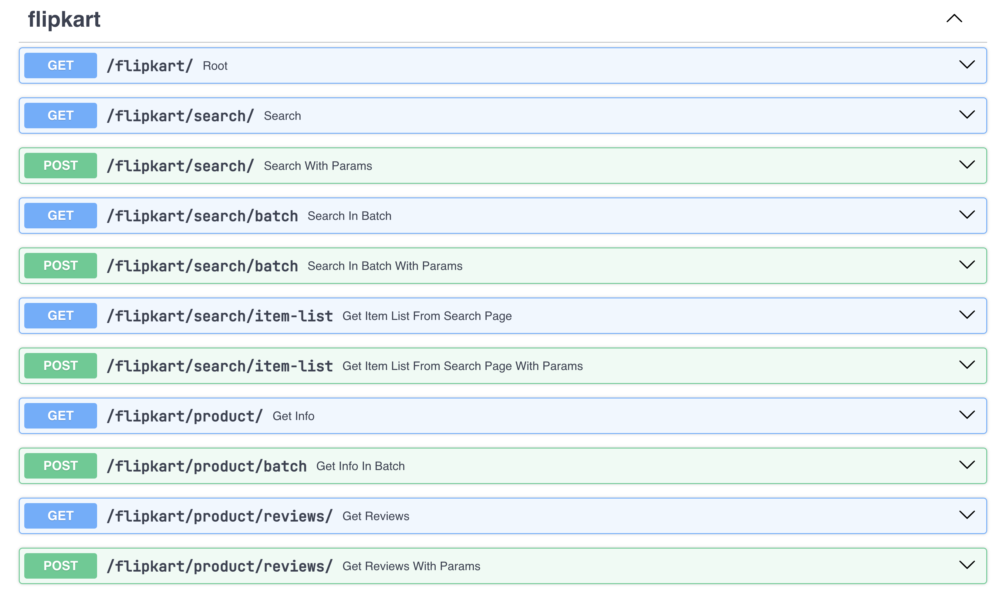

# E-Commerce API

[](https://www.linkedin.com/posts/arv-anshul_fastapi-api-ecommerce-activity-7128575593570340864-WE2m?utm_source=share&utm_medium=member_desktop)
[](https://github.com/arv-anshul)

This is an API project which scrapes data from e-commerce websites (for now only [flipkart.com](https://flipkart.com)).

#### What I Learn While Creating This API?

1. Gets a deep dive into `FastAPI` framework.
2. Learned http request methods further at intermediate level and used more http status codes.
3. Used some awesome tricks to handle Errors and Exceptions.
4. Explored `pydantic` library, modular programming, OOPs concepts and many more things.

### Tech Stacks

|           Stack | Tech                                                                                                        |
| --------------: | :---------------------------------------------------------------------------------------------------------- |
|    Web scraping |  |
|         Backend |         |
| Data Validation |      |
|        Websites |      |
|     Curl Parser |      |

### Usage

1. Clone this repo.
2. Install the projects requirements with following command:

```sh
pip install -r requirements.txt
```

3. Run the fastapi app.

```sh
uvicorn --reload ecommerce.api.app:app
```

4. Now FastAPI instance is running on your system. So, you can access it on your localhost with the following url:

```url
http://localhost:8000/
```

For better representation of the APIs head to:

```url
http://localhost:8000/docs
```

### API Endpoints

#### Screenshot of OpenAPI Docs


